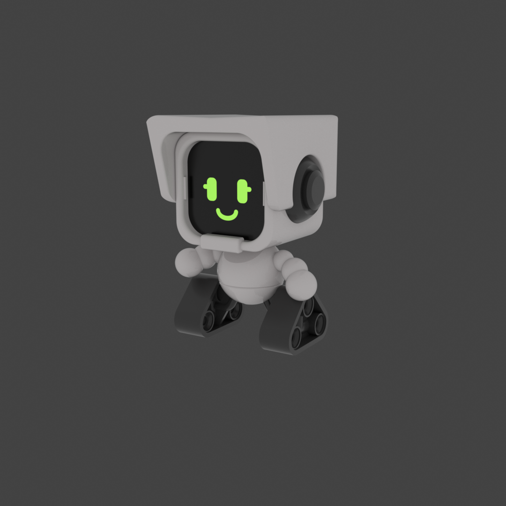
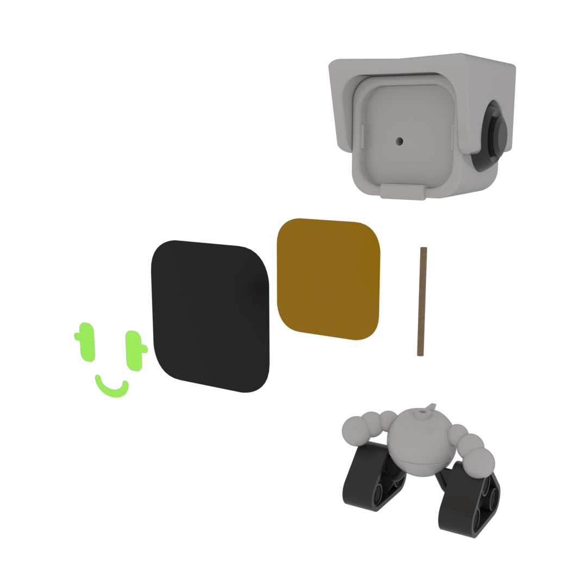

# Spelunky 2 LISE

- Download from Printables here: [`Download Link`](https://www.printables.com/model/506964-spelunky-2-lise)
- Download from Thingiverse here: [`Download Link`](https://www.thingiverse.com/thing:5309271)

## Summary

LISE from Spelunky 2!

* * *

# Summary

This figure is Funko POP! sized and features interchangeable faces!

- **Updates**
	- **11/26/2025:** Updated model for printability.

# Print Settings

- Supports: Support on build plate only
- Infill:
	- Head: 10%
	- Body: 15% - 25%
- Brim: false

# Bill of Materials

- One 3 mm wooden grill skewer
- Permanent adhesive
- Adhesive vinyl sheets in black and green for the default facial expression.
- Cardstock

# Assembly

- **Assembling the head and body**
	- Measure and cut the 3 mm rod at 1.5 inches.
	- Apply glue to the 3 mm hole located on the bottom of the head and insert the 2-inch rod into the hole until it stops.
	- Apply glue to the 3 mm hole and rib located on top of the body.
	- Insert the head assembly into the hole on top of the body until the rib meets the bottom side of the head assembly.
	- Leave the head in the desired position until the glue dries.
	- Refer to `assembly.pdf` for a detailed exploded view.

- **Assembling the face**
	- Cut the black vinyl to the desired shape to form the background.
		- Refer to `lise-face.pdf` for dimensions.
	- Apply the background decal to the cardstock for added rigidity.
	- Cut the cardstock around the black vinyl.
	- Cut the facial features according to their color and apply them on top of the black vinyl.
	- Attach the face to the head by snapping it behind the two tabs on the left and right sides of the face.
	- The screen can be removed and replaced with different facial features by inserting a 3 mm rod through the channel on the back of the head.
	- Refer to `assembly.pdf` for a detailed exploded view.

# Additional Information

- **Notes**
	- Nine faces are included with the model and are in the SVG format. Each layer is a facial feature of a single color. This can be cut by hand or more accurately on a machine like the [Cricut](https://cricut.com/en_us). Alternatively, you can print and cut `lise-face.pdf` for each facial expression.

# A Note from the Designer

Hey! Thanks for checking out my design and I hope you have a good time with it. If you've printed and assembled this design I'd love to see it. Post a make of this model to the Printables page assembled. If you have any issues with the model please let me know, and you can even open an issue on this model's [GitHub](https://github.com/EvokeMadness/Lise) page. If you have any suggestions for this model please leave a comment. The source files for this design can be found on its [GitHub](https://github.com/EvokeMadness/Lise) page.

Happy printing!

* * *

# Previews

